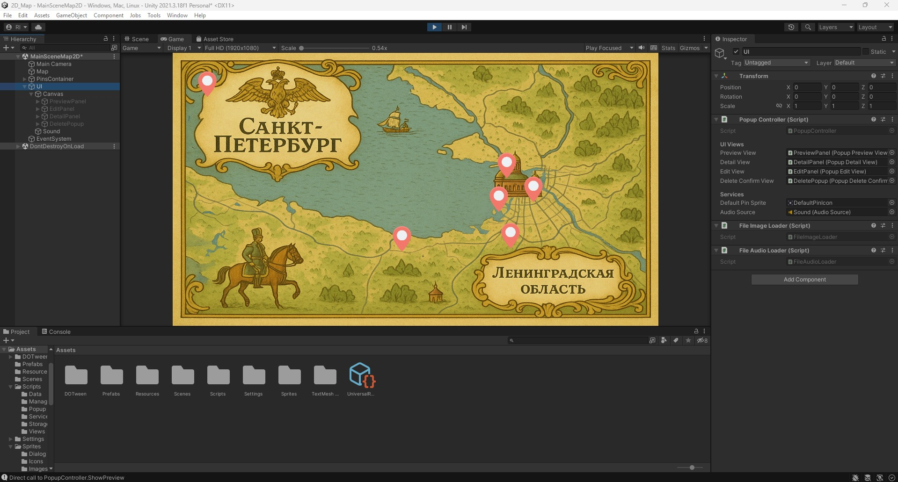
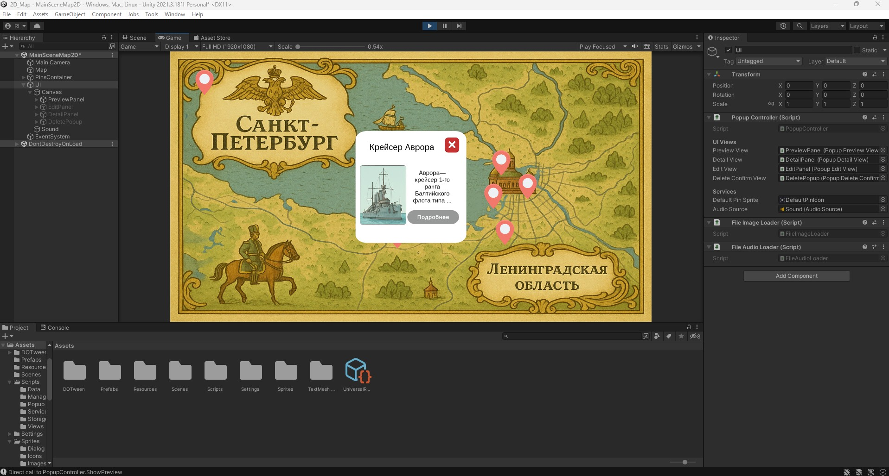
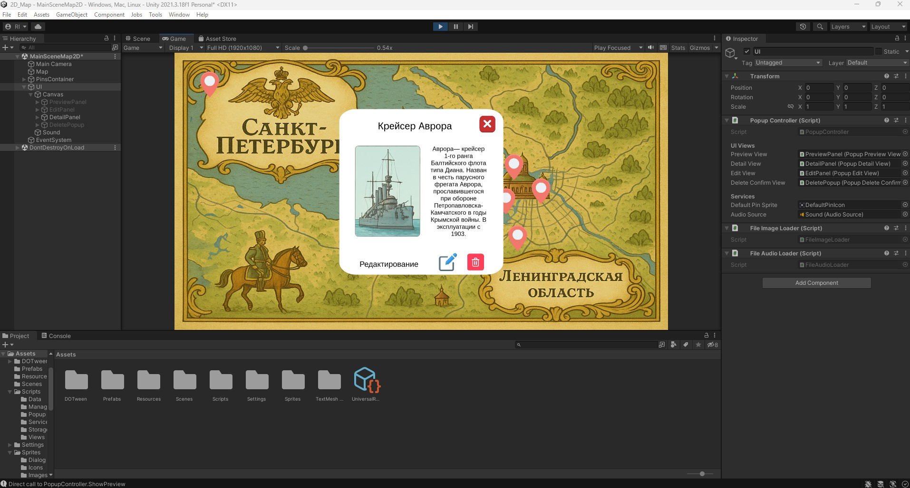
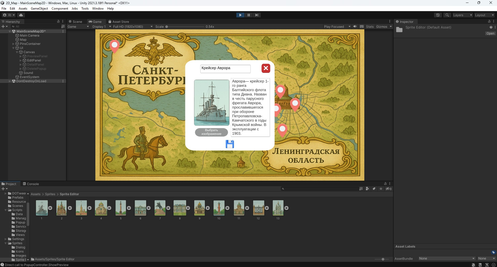
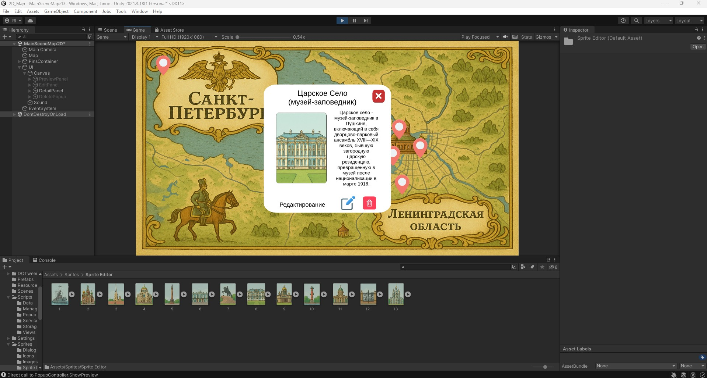
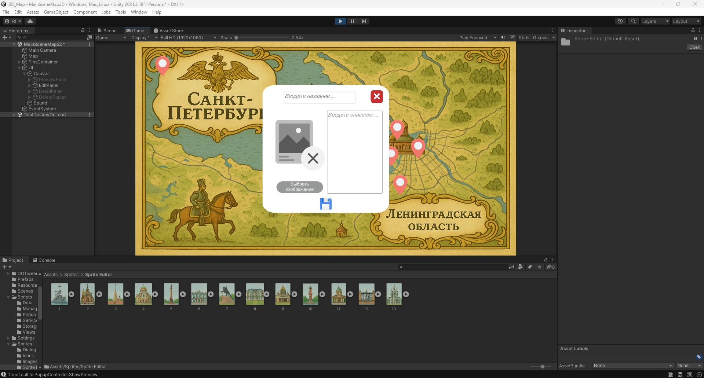

# 2D_PinMap
2D-игра. Интерактивный картографический каталог с возможностью добавлять информационные пины о различных местах.
Unity 2021.3.18  

**Особенности:**
- Возможность добавлять информационные пины о различных местах;
- Пины могут содержать информацию о городах, важных местах, природных заповедниках, флоре или фауне (название, фото, описание);
- Пины сохраняются и после перезапуска (ChunkedGZipStorage);
- Реализован функция Drag and Drop самих пинов;
- Реализована возможность предпросмотра пина во всплывающем окне и подробного просмотра пина по нажатию кнопки;
- Реализовано редактирование пина, а также его удаления;
- Использование библиотеки DOTween для анимаций, а также SOLID и паттернов (Singleton, State Machine, Observer, Strategy);
- Адекватная работа до 25.000+ пинов на карте (загрузка должна быть < 1 сек).

**TODO (на будущее):**
- Переход на SQLite при > 25.000+ пинов на карте (из за возможных временных задержек, более 3 секунд);
- Интеграция нативного плагина для работы с фото в итоговом билде под устройство;
- Доработка аудио-модуля;
- Возможность функции масштабирования карты;
- Пул объектов;
- Корректировки форм UI панелей;
- DI (Zenject).

---

### 🎮 Скриншоты

  

  

  

  

  

  

</table>

